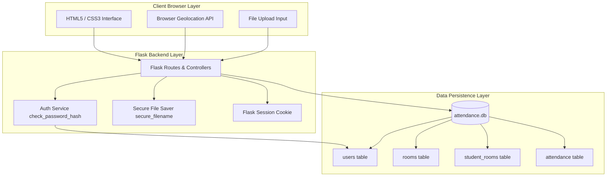

# Cloud Attendance System

Cloud Attendance is a secure, lightweight, and modern classroom attendance management application written in Flask and SQLite3. It is designed to verify student attendance through geolocation tracking and proof-of-work file uploads.

## Features

- **Relational Integrity with SQLite**: Switched from JSON storage to transaction-safe SQLite database (`data/attendance.db`) with active foreign keys.
- **Secure Password Hashing**: Utilizes industry-standard salted `scrypt`/`PBKDF2` encryption (via `werkzeug.security`) to encrypt student and teacher passwords.
- **Geolocation Verification**: Resolves and records student coordinates at submission time to verify physical presence.
- **Proof-of-work Uploads**: Students attach daily work logs (PDFs, images, documents) which teachers can view and verify.
- **Teacher Dashboard**: Allows classroom creation, log auditing (with Google Maps location plotting), and exporting lists to CSV.
- **Student Dashboard**: Shows summary statistics (total classes joined, total logs, points accumulated, average attendance percentage) and past history.
- **Railway/Render Deployment Ready**: Pre-configured with dynamic environment keys, `requirements.txt`, and `Procfile`.

---

## Technical Stack

- **Backend**: Python 3, Flask, SQLite3
- **Frontend**: HTML5, Vanilla JavaScript (Geolocation API), CSS3 (Modern Light Indigo Theme)
- **Deployment**: Gunicorn

---

## System Architecture

The application implements a 3-tier architecture:



1. **Client Browser Layer**: Renders the dynamic HTML templates and resolves coordinates using the browser's Geolocation API during attendance marking.
2. **Flask Backend Layer**: Manages session state, coordinates routing rules, hashes passwords using Werkzeug security scripts, and saves upload attachments to disk.
3. **Data Persistence Layer**: Connects to a serverless SQLite database to manage user state, enrollments, and coordinate logs.

---

## Getting Started (Local Run)

### 1. Set Up Virtual Environment
Navigate to the `backend` directory and configure python:
```bash
cd backend
python -m venv venv
source venv/bin/activate
pip install -r ../requirements.txt
```

### 2. Run the Application
Start the local server:
```bash
python back.py
```
Open `http://127.0.0.1:5000` in your browser.

---

## Database Schema & Migrations

The database initialization is fully automated. When the application boots, `init_db()` checks for `data/attendance.db`. If empty, it automatically extracts records from old JSON files (`data/users.json`, `data/rooms.json`, `data/attendance.json`, `students.json`), secures plaintext passwords using hashing, and populates the database tables:
- `users`: Accounts info (ID, name, role, hashed password, profile).
- `rooms`: Classrooms metadata.
- `student_rooms`: Enrolment mapping.
- `attendance`: Geolocation logs and daily files.

---

## Railway Deployment Guide

1. Create a project at [Railway](https://railway.app).
2. Connect your GitHub repository.
3. Define the environment variable in Railway's console:
   `SECRET_KEY=your_production_secret_key_here`
4. Deploy! Railway will automatically detect the root `Procfile` and `requirements.txt` and serve the application.
